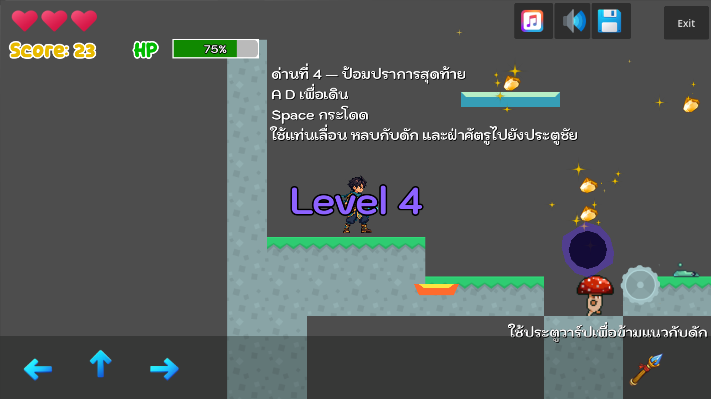

# GAME4 — 2D Platform Side-Scrolling

โปรเจกต์รายวิชา Computer Game Development พัฒนาด้วย Godot 4.7

ผู้พัฒนา: นายธาม อะทอยรัมย์ 673380322-2

## เรื่องราวและวิธีเล่น

ผู้เล่นต้องเดินทางผ่านด่านอันตราย 4 ด่าน เก็บเหรียญและไอเท็มฟื้นพลัง หลบกับดัก และกำจัดมอนสเตอร์เพื่อไปถึงประตูปลายทาง

- `A` / `D` หรือปุ่มลูกศร: เดินซ้าย/ขวา
- `Space` / `W` / ลูกศรขึ้น: กระโดด
- `X`: ยิงอาวุธ
- กระโดดเหยียบศัตรูจากด้านบนหรือยิงศัตรูเพื่อรับคะแนน
- เก็บขวดยาเพื่อฟื้น HP และหลบกับดักที่ทำให้ HP ลด

## คุณสมบัติ

- 4 ด่านที่สร้างด้วย TileMap และมี Collision Polygon
- ฉากหลัง Parallax
- ศัตรู 2 รูปแบบ พร้อมเอฟเฟกต์และเสียงเมื่อถูกกำจัด
- ระบบ HP, ชีวิต, คะแนน, เหรียญ และไอเท็มฟื้นพลัง
- กับดักหลายรูปแบบ อาวุธยิง และกระสุน
- เพลงประกอบและเสียงเอฟเฟกต์
- ระบบบันทึก/โหลดเกม และตั้งค่าเปิด-ปิดเสียง
- เมนู, Credit, Game Over และ Win Game
- รองรับคีย์บอร์ดและปุ่มควบคุมบนหน้าจอ

## ภาพตัวอย่าง

## Demo และเกมออนไลน์

- Demo VDO: เพิ่มลิงก์ Google Drive หรือ YouTube ที่นี่
- Play Game: [https://ouaneng.github.io/GameLab4/](https://ouaneng.github.io/GameLab4/)

ไฟล์ Web export อยู่ในโฟลเดอร์ `docs` โดยใช้ `index.html` เป็นหน้าเริ่มต้น
